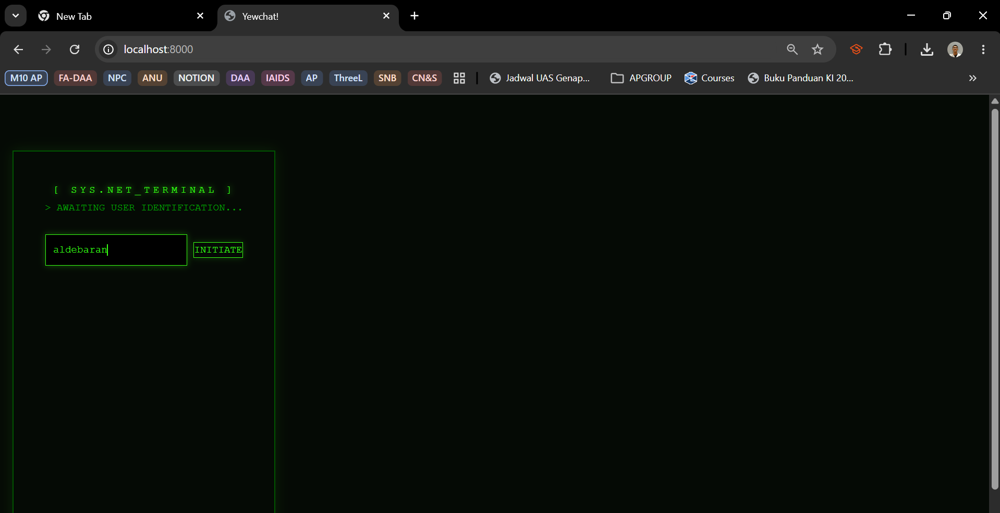
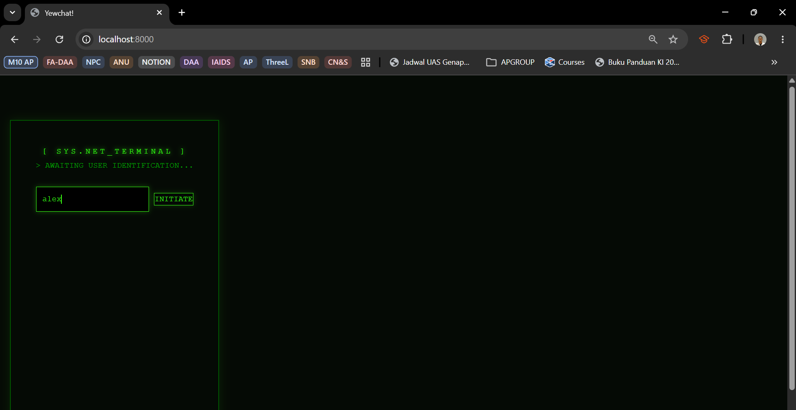
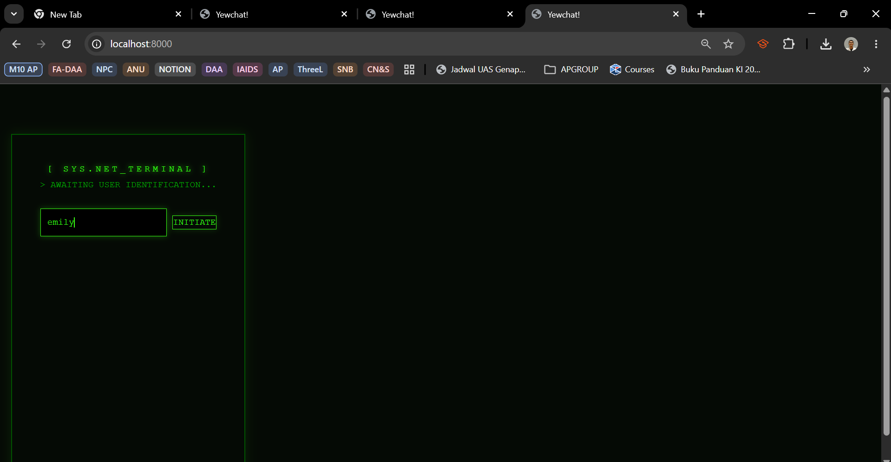
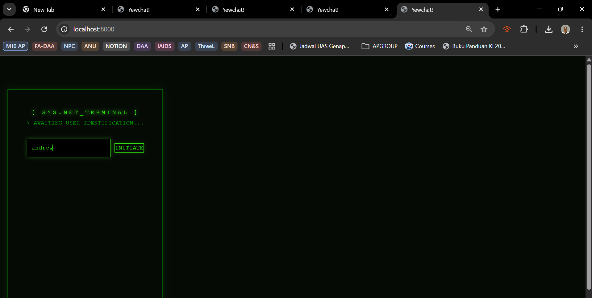
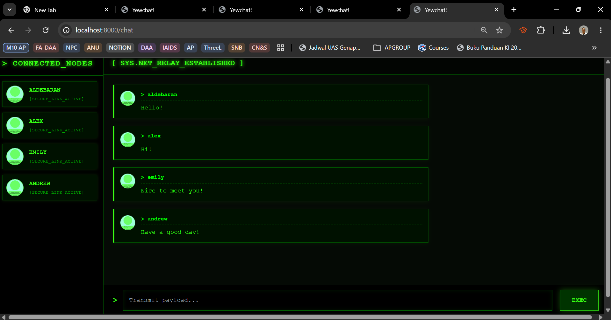

# YewChat 💬

> Source code for [Let’s Build a Websocket Chat Project With Rust and Yew 0.19 🦀](#)

## Install

1. Install the required toolchain dependencies:
   ```npm i```

2. Follow the YewChat post!

## Branches

This repository is divided to branches that correspond to the blog post sections:

* main - The starter code.
* routing - The code at the end of the Routing section.
* components-part1 - The code at the end of the Components-Phase 1 section.
* websockets - The code at the end of the Hello Websockets! section.
* components-part2 - The code at the end of the Components-Phase 2 section.
* websockets-part2 - The code at the end of the WebSockets-Phase 2 section.

# Screenshots for "Experiment 3.2: Be Creative!" commit











For this commit, I implemented a "Retro Hacker Terminal" aesthetic similar to the aesthetic of the "Matrix" movie.
I changed the UI by injecting global CSS into `static/index.html` to strip away standard fonts in favor of monospace typography (`Courier New`). 
I used deep terminal blacks (`#000000`) and high-contrast neon greens (`#39ff14`) with CSS `box-shadow` properties to create glowing buttons and borders. 
In the Yew components (`login.rs` and `chat.rs`), I modified the HTML macros to include ASCII-style visual markers like `[ SYS.NET_TERMINAL ]` and `>` prompt indicators to complete the immersive CLI aesthetic. 
This was achieved entirely through CSS and HTML macro restructuring without modifying the underlying WebSockets or Yew state management functionality from the tutorial.
